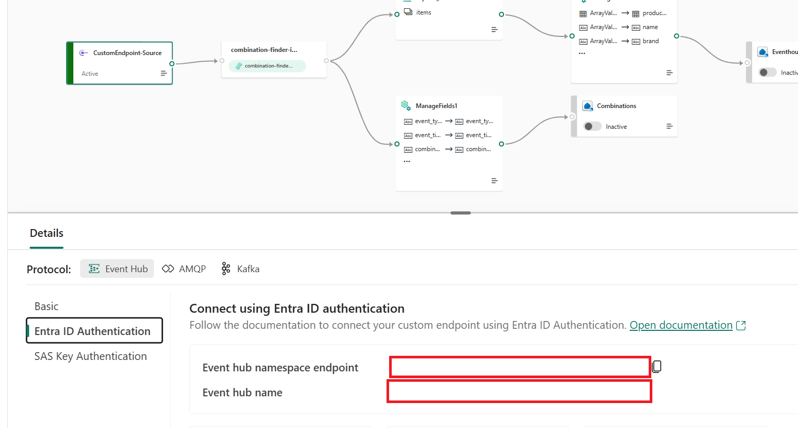
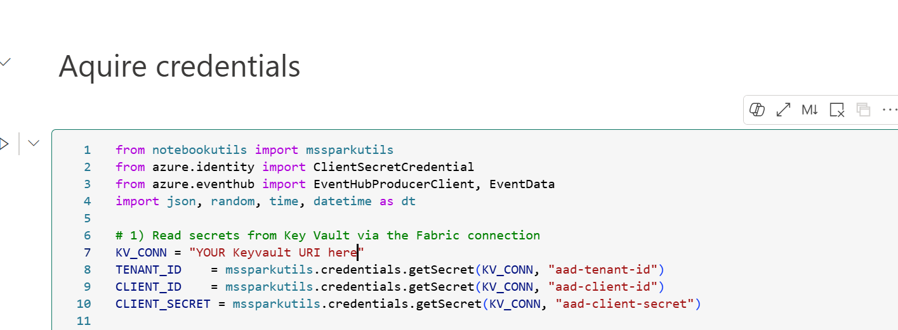

# Fabric

## Setup
1. Create a new Workspace and sync the Workspace folder into it.
2. Create a service principal and an Azure Key vault
3. Create the following secrets in the Keyvault:
- "aad-tenant-id": Directory (tenant) ID
- "aad-client-id": Application (client) ID of the service principal
- "aad-client-secret": Generate a new service principal client secret
- "es-fqdn-sales": Grab the FQDN of the custom endpoint of the Eventstream RTI/ecommerce-sales-ingest, see picture below
- "es-name-sales": Grab the Eventstream name of the custom endpoint
Eventstream RTI/ecommerce-sales-ingest, see picture below

 - "es-fqdn-combinations": See above, but for RTI/ecommerce-combination-ingest
 - "es-name-combinations": See above, but for RTI/ecommerce-combination-ingest

4. Assign the service principal the "Key Vault User" role on the Key vault
5. Enable public network access on the Key Vault: Under settings > Networking, enable "Allow public access from all networks"
6. Copy the Key Vault URI from the Overview Tab of the Azure Key vault and insert it into the "demodata-ecommerce stream (combinations and sales)" notebook under "RTI/streaming demodata" in Line 7 in the first block

7. Add the service principal to the Fabric workspace with role "Contributor" 

## Loading your Data

1. Run your "demodata-ecommerce stream (combinations and sales)" notebook and check that you don't see any errors. The notebook will be running in the background continuously and simulate streaming sales and newly created combinations.

2. In another tab, go to the data pipeline "Full load", located in the Folder "Data pipelines + Data agents" and run the pipeline.