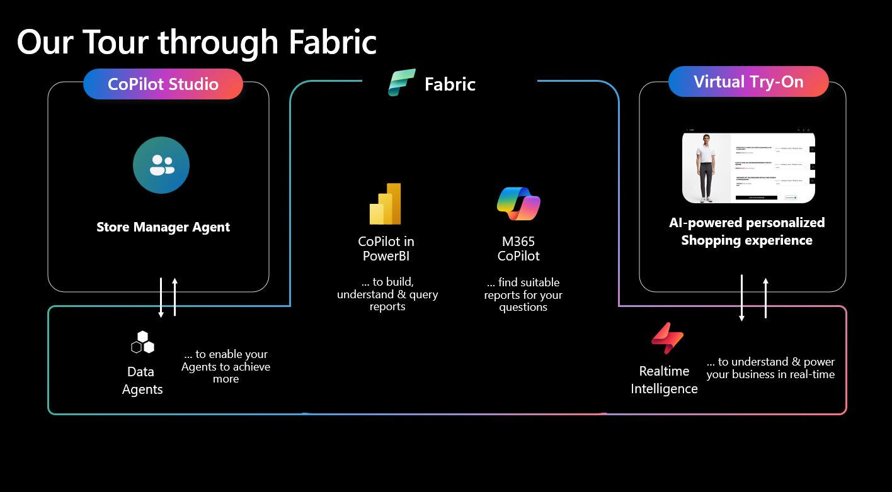

# Dataplatform for Retail

A high-level demo consisting of three components showcasing the Microsoft Platform for a Cross-Solution Area Demo focused on Fabric as the enabler for intelligence across your retail organization.

## Architecture

The demo consists of three parts:
* Store Manager Agent: A simple CoPilot-Studio Agent that supports employees in a retail store with answering questions about the inventory and other product related questions

* Fabric Data Agent & CoPilot in PowerBI: The data agent supplies data to the store manager agent and and example report can be used to query and modify the report in natural language

* Virtual Try On: AI-powered personalized shopping experience in which shoppers can create custom outfits by combining different pieces of clothing with GPT Image 1.5. The data is streamed into Fabric to enable Realtime insights into trends.

## Setup
To setup the demo for yourself, please request a teannt with CoPilotStudio licenses and at least one Azure Subscriptions or enable PAYGO billing for CoPilotStudio. Then follow the README.md files in the respective directories.

## Running the demo